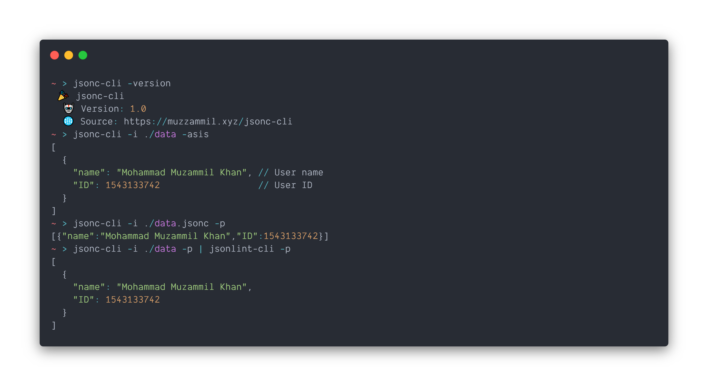

# jsonc-cli

A CLI for jsonc - json with comments



Provides conversion and validation capabilities for jsonc files. jsonc-cli can perform two operations right now.

1. Takes jsonc files as input and outputs json file without comments
2. Checks if provided jsonc file is a valid jsonc or not.

## Build

Requires [git](https://git-scm.com/download/win) to clone and [Go](https://golang.org/dl/) to build.

Clone and navigate to directory

```sh
$ git clone https://github.com/muhammadmuzzammil1998/jsonc-cli.git
$ cd jsonc-cli
```

Get dependencies and build

```sh
$ go get -d .
$ go build
```

## Installation

### From releases

Follow the guide on the [releases](https://github.com/muhammadmuzzammil1998/jsonc-cli/releases) page for detailed instructions.

#### Linux (.deb)

Download `.deb` file for jsonc-cli from the [releases](https://github.com/muhammadmuzzammil1998/jsonc-cli/releases) page.

```sh
$ wget https://github.com/muhammadmuzzammil1998/jsonc-cli/releases/download/{version}/jsonc-cli-linux-{amd64/386}.deb
```

Install using `dpkg`

```sh
$ sudo dpkg -i jsonc-cli-linux-{amd64/386}.deb
```

#### Windows

Start PowerShell as an admin

Download `.exe` file for jsonc-cli from the [releases](https://github.com/muhammadmuzzammil1998/jsonc-cli/releases) page.

```ps
PS > Invoke-WebRequest https://github.com/muhammadmuzzammil1998/jsonc-cli/releases/download/{version}/jsonc-cli-windows-{amd64/386}.exe -OutFile jsonc-cli.exe
```

Move `jsonc-cli.exe` to `C:\Windows` or store it somewhere and add it to path.

```ps
PS > mv .\jsonc-cli.exe C:\Windows\jsonc-cli.exe
```

#### Other OSs

You can download the [binary already built](https://github.com/muhammadmuzzammil1998/jsonc-cli/releases) for your system or [build it yourself](https://github.com/muhammadmuzzammil1998/jsonc-cli#build). To install, see [install from source](https://github.com/muhammadmuzzammil1998/jsonc-cli#from-source)

#### NOTE: This should be obvious but still

- Adapt `{version}` number. Check version number from [here](https://github.com/muhammadmuzzammil1998/jsonc-cli/releases).
- Choose your architecture, `amd64` for 64 bit and `386` for 32 bit systems.

### From source

Clone and navigate to directory

```sh
$ git clone https://github.com/muhammadmuzzammil1998/jsonc-cli.git
$ cd jsonc-cli
```

Get dependencies and build

```sh
$ go get -d .
$ go install
```

### Via `go get`

```sh
$ go get -t -u muzzammil.xyz/jsonc-cli
$ jsonc-cli -version
 🎉 jsonc-cli
  🤖 Version: 1.0
  🌐 Repository: https://github.com/muhammadmuzzammil1998/jsonc-cli
```

## Documentation

### Help

| Flags    | Description                                            |
| -------- | ------------------------------------------------------ |
| -i       | Path to the source file.                               |
| -o       | Path to the output file.                               |
| -asis    | Print the JSONC as-is. Can be piped.                   |
| -p       | Print the JSON converted data to screen. Can be piped. |
| -v       | Check if provided jsonc file using -i is valid or not  |
| -version | Prints version and other details                       |
| -help    | Prints help                                            |

### Usage

Converting a jsonc file to json

```
$ jsonc-cli -i data.jsonc
 🤖 No destination provided. Using source filename ./data.json
 ✅ Coversion successful! JSON written to ./data.json
$ jsonc-cli -i data -o js
 🤖 No destination provided. Using source filename ./data.json
 ✅ Coversion successful! JSON written to ./js.json
```

Printing converted JSON

```
$ jsonc-cli -i data.jsonc -p
[{"name":"Mohammad Muzammil Khan","ID":1543133742}]
```

Printing JSONC as-is

```
$ jsonc-cli -i data.jsonc -asis
[
  {
    "name": "Mohammad Muzammil Khan", // User name
    "ID": 1543133742 // User ID
  }
]
```

Validating JSONC

```
$ jsonc-cli -i data.jsonc -v
 👍 Valid - the jsonc file .\data.jsonc is valid
```

\* Adding extension is optional. However, it reducing ambiguity and chances of error.

## Contributions

Contributions are welcome but kindly follow the [Code of Conduct](CODE_OF_CONDUCT.md) and guidelines. Please don't make Pull Requests for typographical errors, grammatical mistakes, "sane way" of doing it, etc. Open an issue for it. Thanks!
